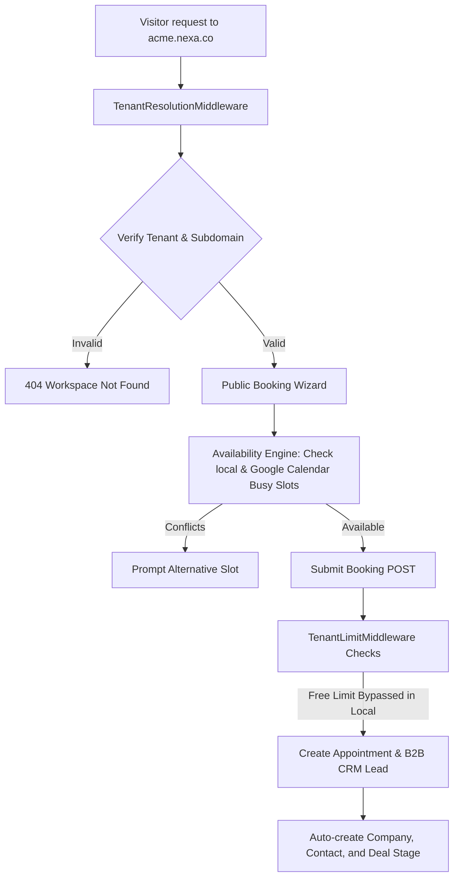

# Nexa - Premium B2B SaaS Scheduling & CRM Infrastructure

Nexa is a commercial-grade, multi-tenant scheduling and B2B CRM SaaS platform. Built on a secure multi-tenant architecture, Nexa enables organizations to deploy custom-branded booking pages, sync internal schedules directly with external calendars (via Google OAuth), and automatically pipe bookings into an enriched B2B CRM sales funnel.

---

## 🚀 Key Architectural Pillars

### 1. Host-Level Multi-Tenant Isolation
* **Dynamic Workspace Routing**: Incoming requests are resolved at the middleware layer based on hostname context—supporting tenant subdomains (e.g. `acme.nexa.co`) as well as custom domain mappings (e.g. `book.acme.com`).
* **White-Label Customization**: Tenants can upload custom logos, configure email footer parameters, and select primary brand color schemes which are injected dynamically into public-facing booking views via CSS custom variables (`--primary-color`).
* **Interactive Host Selection**: If a tenant has multiple staff members, the system renders a premium, glassmorphic host-selection card directory before loading the calendar slot scheduler.

### 2. Trust Layer: Calendar OAuth Integrations
* **Real-time Conflict Checking**: Availability checks query both local Nexa records and external busy slots from the provider's connected Google Calendar.
* **Encrypted Credentials**: Tokens are cast-encrypted at rest inside `user_calendar_connections` using Laravel’s model encryption to guarantee compliance and security.
* **OAuth Simulation**: Local fallback mocks enable local developers to test connectivity and sync workflows without requiring live Google Client Secrets.

### 3. Identity & Growth: B2B CRM Pipeline
* **Auto-Enrichment Funnel**: Booking form submissions automatically query and seed company profiles, associate contact objects, and calculate lead engagement scores.
* **Visual Deals Board**: New bookings populate a customizable CRM sales pipeline.
* **Enterprise AI Modules**: Includes support for automated post-meeting AI summaries and analytics dashboards.

### 4. Local Development Mode (Limit Exemptions)
To facilitate smooth offline development and staging without recurring subscription checks:
* The Free plan limit of 1 staff profile is expanded to **100** in local mode.
* The Free monthly appointment limit of 20 is expanded to **1000** in local mode (seeding data does not block booking forms).
* Enterprise AI summarization blocks are bypassed in local mode.

---

## 🛠️ Tech Stack

* **Backend**: Laravel (PHP >= 8.2)
* **Frontend**: Vue.js 3 (Single Page Application via Vite)
* **Database**: SQLite (Local development), MySQL/PostgreSQL (Production)
* **Styling**: Modern Vanilla CSS, premium glassmorphism, responsive micro-animations
* **Integrations**: Google Calendar API v3 (OAuth 2.0)

---

## 📡 System Flow Diagram



---

## ⚙️ Installation & Local Setup

### Prerequisites
* **PHP >= 8.2**
* **Composer**
* **Node.js >= 18**
* **SQLite / MySQL**

### Step-by-Step Configuration

1. **Clone the Repository**:
   ```bash
   git clone https://github.com/Hubrisdog/nexa.git
   cd nexa
   ```

2. **Configure Environment File**:
   Copy `.env.example` to `.env` and fill out your local settings:
   ```bash
   cp .env.example .env
   ```

3. **Install Dependencies**:
   ```bash
   composer install
   npm install
   ```

4. **Generate Application Cryptography Key**:
   ```bash
   php artisan key:generate
   ```

5. **Run Migrations & Seed Mock Database**:
   Seeding will pre-populate an admin user, multiple providers, mock CRM pipeline data, and initial bookings.
   ```bash
   php artisan migrate --seed
   ```

6. **Compile Frontend Bundles**:
   ```bash
   # Compile production assets
   npm run build
   
   # Or run Vite's HMR hot reload server
   npm run dev
   ```

7. **Start the PHP Development Server**:
   ```bash
   php artisan serve
   ```
   Access the dashboard at `http://localhost:8000`.

---

## 🧪 Testing and Verification

Nexa includes a robust test suite covering host resolution, calendar conflicts, and registration flows.

Run the test suite locally:
```bash
php artisan test
```

Tests run on an isolated in-memory connection configured in `phpunit.xml`, ensuring your local SQLite database remains untouched.
