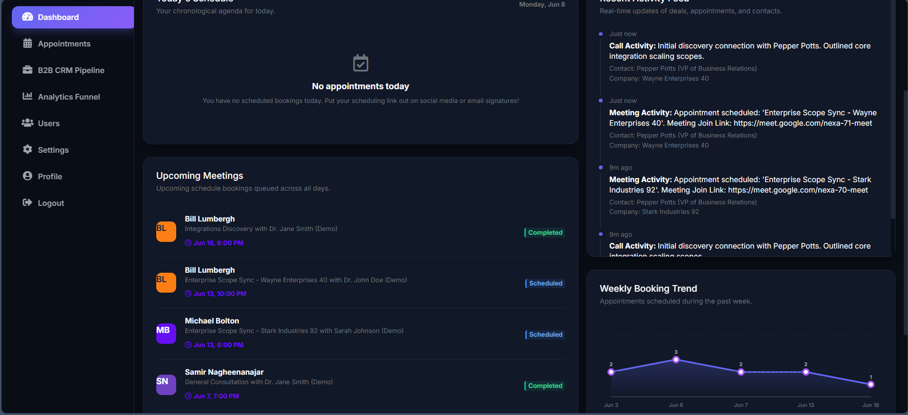
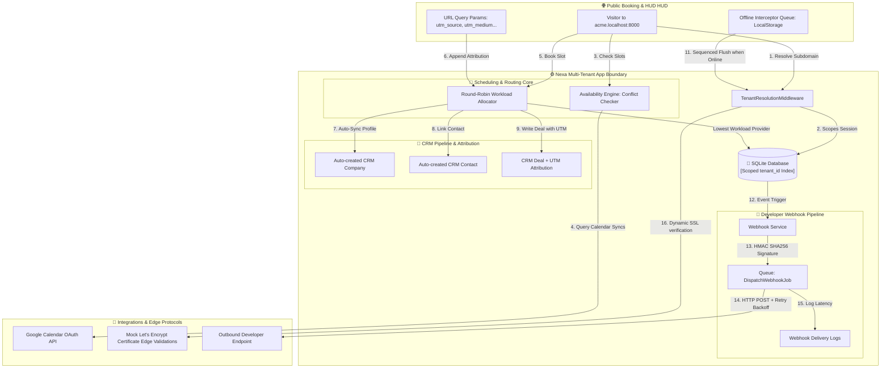

<p align="center">
  
</p>

<p align="center">
  <a href="https://laravel.com/"></a>
  <a href="https://vuejs.org/"></a>
  <a href="https://sqlite.org/"></a>
  <a href="#developer-webhook-infrastructure"></a>
</p>

# Nexa

Multi-tenant scheduling and CRM platform built with Laravel and Vue.

Nexa allows organizations to create branded booking pages, manage team availability, capture booking attribution data, and track leads through a CRM pipeline. The project explores tenant isolation, scheduling automation, webhook integrations, custom domains, and offline-first client workflows.

## Current Features

* Multi-tenant workspace architecture
* Public booking pages
* Team and collective scheduling
* Workload-based round-robin assignment
* CRM pipeline with UTM attribution tracking
* Google Calendar integration
* HMAC-signed outbound webhooks
* Custom branding and domain management
* Offline mutation queue with automatic synchronization
* Demo workspace provisioning

## Technical Overview

Nexa uses a single-database multi-tenant architecture where application data is scoped by tenant identifiers. Bookings, CRM records, webhook subscriptions, and user accounts are isolated at the application and database layers.

The scheduling engine supports availability checks, provider assignment, and workload-balanced routing. Booking events can trigger outbound webhooks and CRM updates while preserving attribution metadata captured during the booking process.

This repository is currently an active development project and serves as both a learning platform and a foundation for future SaaS experimentation.

## Why I Built This

Most scheduling applications stop at appointment booking.

Nexa explores what happens after a booking is created:

- How should appointments be distributed across a team?
- How can attribution data be preserved?
- How can bookings automatically flow into CRM workflows?
- How can organizations manage branding and domains in a multi-tenant environment?

The project serves as a practical exploration of scheduling systems, CRM workflows, webhook infrastructure, and SaaS architecture using Laravel and Vue.

This single section tells recruiters and engineers what your thinking process was.
 

---

## Local Demo Walkthrough Guide

Nexa is designed to run locally on your development system to avoid unnecessary hosting costs. 

### Quick Walkthrough Guide

To explore the scheduling and CRM pipelines:

1. **Authentication (Demo Auto-Login)**:
   - Access the local `/demo` route. The system will automatically generate a mock demo workspace (`demo` slug), seed initial analytics, and log you in as a system administrator.
2. **Branding & Custom Domain**:
   - Go to **Settings -> Branding & Logo** and modify the organization name, brand color, and custom domain (e.g. `book.acme.com`). The system dynamically updates the layout variables (`--primary-color`) across all client-facing scheduling interfaces.
3. **Automated SSL Lifecycle**:
   - Navigate to the new **Settings -> Domains & SSL** widget. Observe CNAME record instructions, and click **Verify DNS & Activate SSL** to trigger a simulated edge Let's Encrypt validation routine.
4. **Outbound Developer Webhooks**:
   - Navigate to the new **Settings -> Webhooks** panel. Configure an endpoint (e.g., mock target URL) and a signing secret. Use the **Test Payload** button to queue a simulated event, and check the delivery logs list.
5. **Offline Resiliency Syncing**:
   - To test offline resiliency: disconnect your network connection (or toggle offline mode in browser devtools). Update a deal stage on the **CRM Pipeline** board. A floating red warning alert will indicate offline mode. Reconnect your network to trigger automatic client-side synchronization and see the green success banner.
6. **Simulate a Booking (Round-Robin)**:
   - Visit the public booking link for the workspace (`/booking/team`) and append UTM parameters to the URL: `/booking/team?utm_source=google&utm_medium=cpc&utm_campaign=summer_promo`.
   - Select the **Collective Team Booking** option. Book an available slot. The round-robin algorithm will automatically resolve active providers and route the slot to the available provider with the lowest daily appointment count.
7. **Inspect the CRM Kanban & Attribution**:
   - Navigate back to the **CRM Pipeline** tab. Verify that the newly created deal has the captured UTM attribution parameters (`utm_source=google`, etc.) and the deal is associated with the selected provider.

---

## Table of Contents

1. [Local Demo Walkthrough Guide](#local-demo-walkthrough-guide)
2. [System Architecture](#system-architecture)
3. [Core Technical Specifications](#core-technical-specifications)
4. [Directory Workspace Layout](#directory-workspace-layout)
5. [Deployment & Architectural Considerations](#deployment--architectural-considerations)
6. [Prerequisites & Development Setup](#prerequisites--development-setup)
7. [Testing & Verification](#testing--verification)

---

## System Architecture

Nexa manages tenancy, resolves custom domains, handles collective team availability, executes workload-based round-robin routing, and runs outbound webhook sync hooks:



---

## Technical Highlights

### 1. Webhook Signing & HMAC Authentication
To protect external endpoints against payload injection attacks, Nexa computes an `HMAC SHA256` signature using the webhook's configured secret and attaches it to the `X-Nexa-Signature` header:
```php
// From /app/Jobs/DispatchWebhookJob.php
$payloadJson = json_encode($this->payload);
$signature = hash_hmac('sha256', $payloadJson, $subscription->secret);

$response = Http::withHeaders([
    'Content-Type' => 'application/json',
    'X-Nexa-Event' => $this->event,
    'X-Nexa-Signature' => $signature,
])->timeout(10)->post($subscription->url, $this->payload);
```

### 2. Workload-Balanced Round-Robin Allocation
Collective booking slots route dynamically to the staff member with the lowest appointment count for the selected day. If counts are equal, the system routes to the first available member (lowest User ID):
```php
// From /app/Http/Controllers/PublicBookingController.php
foreach ($providers as $p) {
    $check = $availabilityService->checkAvailability($p, $start, $end);
    if ($check['available']) {
        $count = Appointment::where('staff_id', $p->id)
            ->whereBetween('start_time', [$startOfDay, $endOfDay])
            ->count();
        $eligibleProviders[] = ['provider' => $p, 'count' => $count];
    }
}
usort($eligibleProviders, function($a, $b) {
    if ($a['count'] === $b['count']) {
        return $a['provider']->id <=> $b['provider']->id;
    }
    return $a['count'] <=> $b['count'];
});
$provider = $eligibleProviders[0]['provider'];
```

### 3. Offline Synchronization Queue
Nexa intercepts data mutations (`POST`, `PUT`, `DELETE`, `PATCH`) on network failure or offline states, serializes them to `localStorage`, and queues them for sequential FIFO syncing when connection returns:
```javascript
// From /resources/js/utils/offlineQueue.js
export function registerOfflineInterceptor(onOfflineTriggered, onSyncCompleted) {
    axios.interceptors.request.use((config) => {
        if (isMutation(config) && !navigator.onLine) {
            addToQueue(config);
            if (onOfflineTriggered) onOfflineTriggered(config);
            return Promise.reject({ isOfflineQueue: true, config });
        }
        return config;
    });
}
```

### 4. Tenant-Aware User Constraints
To support tenant data scoping without risking duplicate guest emails colliding across organizations, Nexa drops the global database-level index and enforces a composite database-level index:
```php
// From /database/migrations/2026_06_08_000000_fix_users_unique_constraint.php
Schema::table('users', function (Blueprint $table) {
    $table->dropUnique(['email']);
    $table->unique(['email', 'tenant_id']);
});
```

---

## Directory Workspace Layout

```
Nexa/
├── app/
│   ├── Http/
│   │   ├── Controllers/
│   │   │   └── Admin/           # Admin Dashboard, CRM, AI, Webhook & OAuth Controllers
│   │   └── Middleware/          # Tenant Resolution & Subscription Limit Checkers
│   ├── Jobs/                    # Outbound Webhooks (DispatchWebhookJob) & Calendar Sync
│   ├── Models/                  # Multi-tenant Eloquent models (WebhookSubscription, WebhookDelivery)
│   ├── Services/                # Availability, WebhookService, Google & Outlook calendar APIs
│   └── Traits/                  # BelongsToTenant global scoping traits
├── database/
│   └── migrations/              # Webhooks schema & CRM UTM column migrations
├── resources/
│   ├── js/                      # Vue 3 SPA Client Workspace
│   │   ├── pages/               # Calendar, Settings (Webhook/SSL panel), and Auth views
│   │   └── utils/               # Offline queue helper (offlineQueue.js)
│   └── views/                   # Server-side Blade layouts (app.blade.php)
└── routes/
    └── web.php                  # Web, public bookings, and protected admin API routing
```

---

## Deployment & Architectural Considerations

Nexa is optimized for local environments and cost-free execution. To avoid cloud hosting fees, the production platform has purposefully not been deployed to a live server. Below is an architectural overview of why serverless platforms like Vercel are unsuitable for Nexa, followed by budget-friendly alternatives.

### Why Vercel is Not Suitable for Nexa
1. **Stateless Serverless Runtimes (SQLite Conflict)**: Nexa uses a local SQLite database (`database.sqlite`) for storing bookings and CRM data. Vercel's serverless functions are ephemeral—they spin down and reset, which would completely erase your database contents and cause data desynchronization across concurrent client requests.
2. **Persistent Background Queues**: Developer webhook dispatches and email schedules run on Laravel's queue worker (`php artisan queue:work`). Vercel does not support long-running, persistent processes to process queue jobs.
3. **No Native PHP Support**: Vercel is designed for Node.js/frontend runtimes. Running Laravel on Vercel requires community-built runtimes (like `vercel-php`) and complex routing layers (`vercel.json`) that are fragile and harder to maintain.

### Recommended Free & Cheap Hosting Alternatives
If you decide to deploy Nexa in the future without incurring high costs, consider these alternatives:
* **Fly.io / Railway / Render (Zero-to-Low Cost PaaS)**: These platforms offer a git-push workflow like Vercel but run standard persistent containers. You can attach a persistent volume for the SQLite database or host a free tier PostgreSQL database alongside the app.
* **VPS + Laravel Forge / Ploi (~$4/mo)**: You can rent a low-cost VPS from Hetzner, OVH, or DigitalOcean, and manage it with Laravel Forge or Ploi. This automatically sets up Nginx, PHP, SSL (Let's Encrypt), queues, and scheduled cron jobs.

---

## Prerequisites & Development Setup

### System Requirements
* **PHP >= 8.2** (with PDO SQLite extension enabled)
* **Composer**
* **Node.js >= 18**
* **SQLite 3**

### Installation

1. **Clone & Configure Environment**:
   ```bash
   git clone https://github.com/Hubrisdog/nexa.git
   cd nexa
   cp .env.example .env
   ```

2. **Install Dependencies**:
   ```bash
   composer install
   npm install
   ```

3. **Database Initialization**:
   ```bash
   php artisan key:generate
   php artisan migrate --seed
   ```

4. **Run Vite Development Server**:
   ```bash
   npm run dev
   ```

5. **Start PHP Server**:
   ```bash
   php artisan serve
   ```
   Open `http://localhost:8000` in your browser.

---

## Testing & Verification

Run the full PHPUnit verification suite, including our webhooks and round-robin features:
```bash
php artisan test
```

The test suite runs on an isolated in-memory database, verifying:
- Webhook Subscriptions CRUD and HMAC signatures.
- Outbound event delivery and request telemetry logging.
- Team scheduling union calculations.
- Lowest-workload workload round-robin allocation logic.
