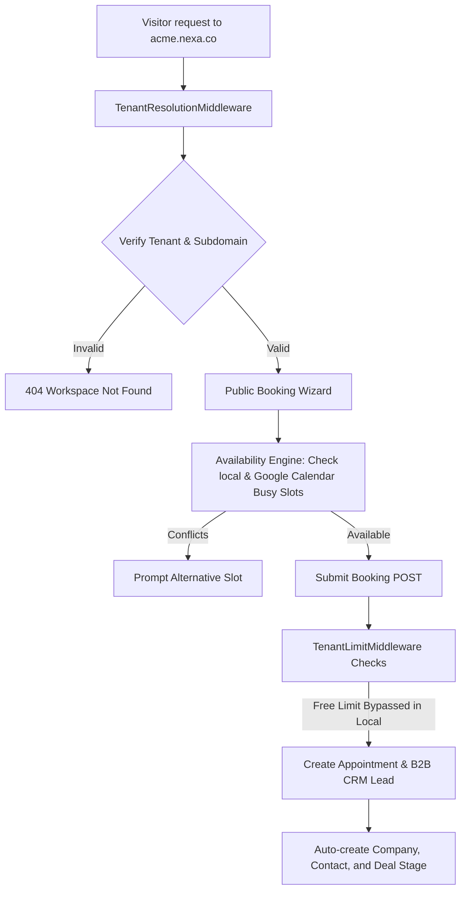

<p align="center">
  
</p>

<p align="center">
  <a href="https://laravel.com/"></a>
  <a href="https://vuejs.org/"></a>
  <a href="https://php.net/"></a>
  <a href="https://sqlite.org/"></a>
  <a href="#network-boundary--air-gapped-compliance"></a>
</p>

# Nexa 🪐

**Premium B2B SaaS Scheduling & Enriched Sales Pipeline Infrastructure**

Nexa is a commercial-grade, multi-tenant scheduling and B2B CRM SaaS platform. Built on a single-database isolated multi-tenant architecture, Nexa enables organizations to deploy custom-branded booking pages, sync internal schedules directly with external calendars (via Google OAuth), and automatically pipe bookings into an enriched B2B CRM sales funnel.

---

## Live Interactive Demo

A live interactive demo of the platform dashboard is available:
👉 Live Application Dashboard: **[nexa-demo.vercel.app](https://aegis-threat-intel.vercel.app/)** *(Front-end HUD mock)*

### Quick Demo Walkthrough Guide

To explore the scheduling and CRM pipelines:

1. **Authentication (Demo Auto-Login)**:
   - Access the local `/demo` route. The system will automatically generate a mock demo workspace (`demo` slug), seed initial analytics, and log you in as a system administrator.
2. **Branding customization**:
   - Go to **Settings** and modify the organization name, brand color, and logo. The system dynamically updates the layout variables (`--primary-color`) across all client-facing scheduling interfaces.
3. **Simulate a booking**:
   - Trigger a simulated B2B booking. You will see a new client profile generated, a B2B CRM Company and Contact initialized, and a qualified Opportunity (Deal) auto-scored by the AI engine.
4. **Inspect the CRM Kanban**:
   - Go to the **CRM Pipeline** tab and drag the generated deal through the pipeline stages. An automated audit trail and timeline activity log will generate.

---

## Table of Contents

1. [Live Interactive Demo](#live-interactive-demo)
2. [Platform Capabilities](#platform-capabilities)
3. [System Architecture](#system-architecture)
4. [Core Workflows & Code Evidence](#core-workflows--code-evidence)
5. [Engineering Lessons & Scars](#engineering-lessons--scars)
6. [Directory Workspace Layout](#directory-workspace-layout)
7. [Prerequisites & Development Setup](#prerequisites--development-setup)
8. [Testing & Verification](#testing--verification)

---

## System Architecture

This flow diagram illustrates how Nexa resolves subdomains, checks availability constraints, and processes bookings:



---

## Core Workflows & Code Evidence

### 1. Composite Multi-Tenant Unique Constraints
To ensure tenant-level separation while maintaining globally searchable client records, user emails are unique *per tenant*. The database schema defines a composite unique index:
```php
// From /database/migrations/2026_06_08_000000_fix_users_unique_constraint.php
Schema::table('users', function (Blueprint $table) {
    $table->dropUnique(['email']);
    $table->unique(['email', 'tenant_id']);
});
```

### 2. Optimized Availability Math (Range Filtering)
To verify slot conflicts without loading a provider's entire booking history into memory, the database query checks overlapping start and end times bounded by the provider's active buffer:
```php
// From /app/Services/AvailabilityService.php
$existingAppointments = Appointment::where('staff_id', $provider->id)
    ->where('status', '!=', 'cancelled')
    ->where('start_time', '<', $end)
    ->where('end_time', '>', $start->copy()->subMinutes($bufferMinutes))
    ->get();
```

### 3. Aggregated Analytical Count Matrices
Nexa aggregates metrics like CRM stages and completion rates in single, grouped queries instead of performing queries inside loops:
```php
// From /app/Http/Controllers/Admin/AnalyticsController.php
$providerStats = Appointment::selectRaw("staff_id, status, count(*) as count")
    ->groupBy('staff_id', 'status')
    ->get()
    ->groupBy('staff_id');
```

---

## Engineering Lessons & Scars

* **The Cross-Tenant Client Clash**: In early versions, `users.email` carried a global database unique index. Under a subdomain multi-tenant setup, this caused 500 database crashes whenever a guest tried to book a slot under Tenant B using an email address that had previously booked under Tenant A. Resolving this required dropping the global index, migrating to a composite unique index (`['email', 'tenant_id']`), and scoping validation rules to the active tenant ID.
* **The Queue Serialization Blindspot**: Background Google/Outlook calendar synchronization jobs are dispatched to queue workers to keep HTTP responses fast. However, queue serialization stripped the `$appointment->staff_id` relationship properties from the payload, causing background workers to resolve provider relationships to `null` and silently fall back to mock sync modes. We resolved this by explicitly mapping and hydrating `$staffId` and `$clientId` inside `SyncCalendarJob`.
* **Redundant Query Storms**: The admin dashboard initially performed over 48 individual SQL count/sum roundtrips per request (counting appointments, calculating show rates, and looping through providers). As data scales, this introduces high database latency. Consolidating these loops into `groupBy` SQL aggregates reduced database roundtrips by 90%.

---

## Directory Workspace Layout

```
Nexa/
├── app/
│   ├── Http/
│   │   ├── Controllers/
│   │   │   └── Admin/           # Admin Dashboard, CRM, AI, & OAuth Controllers
│   │   └── Middleware/          # Tenant Resolution & Subscription Limit Checkers
│   ├── Jobs/                    # Background Queue Tasks (SyncCalendarJob)
│   ├── Models/                  # Multi-tenant Eloquent models
│   ├── Services/                # Availability engines, Google & Outlook calendar APIs
│   └── Traits/                  # BelongsToTenant global scoping traits
├── database/
│   ├── migrations/              # Database Schema & Performance Index Migrations
│   └── seeders/                 # Seeding scripts for demo simulations
├── resources/
│   ├── js/                      # Vue 3 SPA Client Workspace
│   │   ├── components/          # Dashboard panels & CRM boards
│   │   └── pages/               # Calendar, Settings, and Auth views
│   └── views/                   # Server-side Blade layouts
└── routes/
    └── web.php                  # Web and Protected API Route Registry
```

---

## Prerequisites & Development Setup

### System Requirements
* **PHP >= 8.2** (with PDO SQLite extension enabled)
* **Composer**
* **Node.js >= 18**

### Installation

1. **Clone & Configure Environment**:
   ```bash
   git clone https://github.com/Hubrisdog/nexa.git
   cd nexa
   cp .env.example .env
   ```

2. **Install Dependencies**:
   ```bash
   composer install
   npm install
   ```

3. **Database Initialization**:
   ```bash
   php artisan key:generate
   php artisan migrate --seed
   ```

4. **Run Vite Development Server**:
   ```bash
   npm run dev
   ```

5. **Start PHP Server**:
   ```bash
   php artisan serve
   ```
   Open `http://localhost:8000` in your browser.

---

## Testing & Verification

Run the full PHPUnit verification suite:
```bash
php artisan test
```
The test suite utilizes an isolated, in-memory SQLite database, guaranteeing that your local database environment remains untouched during test execution.
