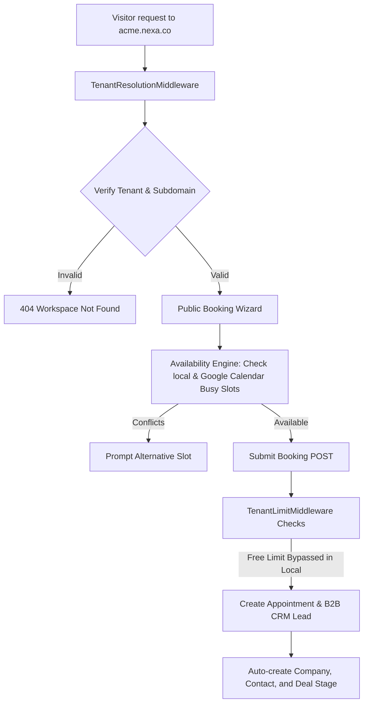

<div align="center">

  # ⚡ NEXA ⚡
  ### *Premium Multi-Tenant Scheduling & Enriched B2B CRM SaaS Infrastructure*

  [](https://laravel.com)
  [](https://vuejs.org)
  [](https://php.net)
  [](https://sqlite.org)
  [](LICENSE)
  [](https://phpunit.de)

  *A commercial-grade, single-database multi-tenant scheduling engine and sales pipeline. Featuring host-level tenant isolation, dynamic styling variable injection, model-encrypted calendar OAuth sync, automatic B2B lead enrichment, and a premium Vue 3 SPA interface.*

  [Key Pillars](#-key-architectural-pillars) • [Tech Stack](#-tech-stack) • [Visual Walkthrough](#-visual-tour) • [Flow Diagram](#-system-flow-diagram) • [Quick Setup](#-quick-setup) • [Verification](#-testing-and-verification)
</div>

---

## 🚀 Key Architectural Pillars

### 1. Host-Level Multi-Tenant Isolation
* **Subdomain & Custom Domain Routing**: Incoming requests are dynamically resolved at the HTTP middleware layer based on the hostname. Supports subdomains (e.g., `acme.nexa.co`) and custom domains (e.g., `book.acme.com`).
* **Dynamic White-Label Styling**: Tenants can upload custom logos, configure brand footer text, and select colors. The branding parameters are injected at boot, dynamically applying CSS custom variables (`--primary-color`, `--bg-brand`) across the Vue 3 SPA frontend.
* **Isolated Data Scoping**: All database models utilize a `BelongsToTenant` trait that automatically scopes queries via an Eloquent global scope to prevent cross-tenant data leakage.

### 2. Trust Layer: Calendar OAuth Integrations
* **Real-time Availability Engine**: Instantly computes free/busy slots by checking local scheduling records alongside external busy intervals pulled directly from the provider's connected Google Calendar.
* **Encrypted Token Store**: Access and refresh tokens are encrypted at rest using Laravel's model-level crypt casting to secure connected email profiles.
* **Resilient Background Syncing**: Reschedules and cancellations dispatch serialized `SyncCalendarJob` background workers, maintaining robust synchronization even under peak loads.

### 3. Growth Engine: B2B CRM Pipeline
* **Lead Enrichment**: Form submissions automatically extract domain info from the client's email to build CRM Company profiles, associate Contact records, and calculate qualified Lead Engagement Scores.
* **Kanban Deals Board**: Features a premium drag-and-drop deals pipeline that automatically tracks revenue potential, logs discovery activities, and transitions leads.
* **Enterprise AI & Analytics**: Includes analytics charts, day-of-week booking heatmaps, and post-meeting AI summary modules.

### 4. Local Development Mode
To facilitate offline development without subscription checks:
* Staff limits are expanded to **100** staff profiles locally.
* Monthly appointments limits are expanded to **1,000** slots.
* Enterprise AI summarization checks are bypassed.

---

## 📸 Visual Tour

*Here are the visual landmarks of Nexa's premium UI. You can replace the image paths below with actual screenshots of your dashboard:*

| Admin Dashboard | Sharing & Booking |
|---|---|
|  <br> *Sleek dark-mode dashboard with real-time stats & heatmaps* |  <br> *Glassmorphic booking page with brand customization* |

| Drag-and-Drop CRM Kanban | Google OAuth Connection |
|---|---|
|  <br> *Visual pipeline tracking leads and deal values* |  <br> *Secure calendar integration settings panel* |

---

## 🛠️ Tech Stack

* **Backend**: Laravel 10 (PHP >= 8.2)
* **Frontend**: Vue.js 3 (Single Page Application via Vite)
* **Database**: SQLite (Local development / testing), MySQL/PostgreSQL (Production)
* **Styling**: Vanilla CSS, premium glassmorphism, responsive micro-animations
* **Integrations**: Google Calendar API v3 (OAuth 2.0)

---

## 📡 System Flow Diagram



---

## ⚙️ Quick Setup

### Prerequisites
* PHP >= 8.2 (with SQLite / PDO extensions)
* Composer
* Node.js >= 18 & npm

### Step-by-Step Configuration

1. **Clone the Repository**:
   ```bash
   git clone https://github.com/Hubrisdog/nexa.git
   cd nexa
   ```

2. **Configure Environment File**:
   Copy `.env.example` to `.env` and fill out your local settings:
   ```bash
   cp .env.example .env
   ```

3. **Install Dependencies**:
   ```bash
   composer install
   npm install
   ```

4. **Generate Application Key**:
   ```bash
   php artisan key:generate
   ```

5. **Run Migrations & Seed Mock Database**:
   Seeding will pre-populate an admin user, multiple providers, mock CRM pipeline data, and initial bookings.
   ```bash
   php artisan migrate --seed
   ```

6. **Compile Frontend Assets**:
   ```bash
   # Compile production assets
   npm run build
   
   # Or run Vite's HMR hot reload server
   npm run dev
   ```

7. **Start the Local Server**:
   ```bash
   php artisan serve
   ```
   Access the dashboard at `http://localhost:8000`.

---

## 🧪 Testing and Verification

Nexa includes a robust test suite covering host resolution, calendar conflicts, and registration flows.

Run the test suite locally:
```bash
php artisan test
```

Tests run on an isolated in-memory connection configured in `phpunit.xml`, ensuring your local SQLite database remains untouched.
